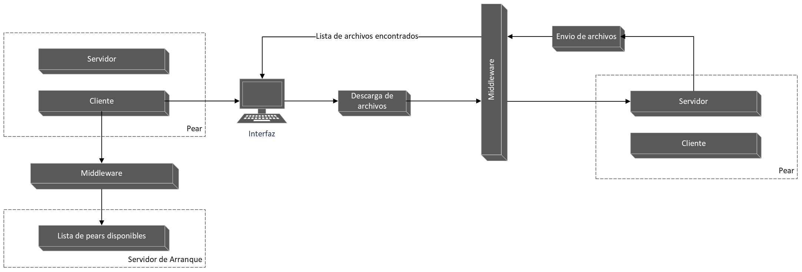
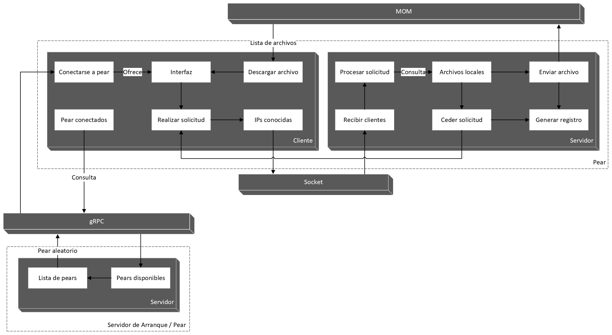
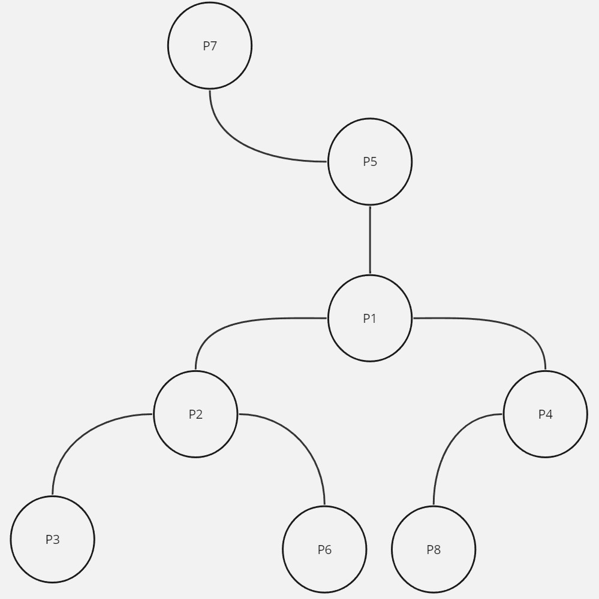

# **ST0263 Topicos Especiales en Telematica**

# **Estudiante**: Daniel Melguizo Roldan, dmelguizor@eafit.edu.co

# **Profesor**: Juan Carlos Montoya Mendoza, jcmontoy@eafit.edu.co

*******

**Tabla de Contenido**
1. [Introduccion](#introduccion)
2. [Requisitos completados y no completados](#requisitos)
3. [Diseño y arquitectura](#arquitectura)
4. [Ambiente de desarrollo](#ambiente)
5. [Ejecucion](#ejecucion)
6. [Referencias](#referencias)

*******

<div id="introduccion" />
  
### **Reto 1 y 2: Red P2P descentralizada**
El reto consiste en crear una red P2P totalmente descentralizada, en la cual, a traves de una interfaz (en este caso desarrollada por consola) los peers podran interactuar con la red, esta interracion sera principalmente para solicitar archivos, la solicitud debera llegar y recorrer los distintos peers conectados en la red en busca del archivo, una vez se encuentre el archivo, se le enviara una lista al peer solicitante de los distintos peers que tienen el archivo en la cual este podra decidir de cual de los peers en la lista descargar el archivo. Cada peer debe tener un archivo config en el cual se establezcan los diferentes datos que se consideren necesarios, minimamente tener, la ip del peer, puerto en el cual estara haciendo listening, directorio en el cual se buscaran los archivos y las ips conocidas por el peer.

*******

<div id="requisitos" />

### ***Requisitos completados***
* La red debe permitir el ingreso de nuevos nodos a la red
* El sistema debe poder encontrar cualquier archivo si lo posee un peer de la red
* Cada peer se debe comportar tanto como servidor como cliente
* El sistema debe ofrecer una interfaz al usuario
* Cada peer debe tener un archivo config
* El sistema debe implementar gRCP como middleware
* El sistema debe implementar MOM como middleware
* Cada peer debe generar un archivo log
* El sistema debe ser capaz de reestructurarse si un nodo abandona la red

### ***Requisitos no completados***
* El sistema debe poder descargar el archivo una vez localizado
* El sistema debe implementar REST API como middleware
* El sistema debe ser totalmente descentralizado
* El sistema debe estar programado en dos lenguajes diferentes

*******

<div id="arquitectura" />

### ***Diseño de alto nivel***


### ***Arquitectura***



*******

<div id="ambiente" />
  
### ***3. Descripción del ambiente de desarrollo y técnico***
Este reto fue desarrollado en python, la carpeta Bootsp inicialmente fue pensada para el desarrollo del servidor de arranque en javascript al final se presentaron algunos problemas en el manejo de sockets dentro del lenguaje, que por alguna razon bloqueaban el servidor asi que fue adaptado de igual manera a python para un correcto funcionamiento.

Para el desarrollo de este reto use las siguientes librerias, todas las que son necesarias instalar vienen para ser instaladas dentro del archivo texto requirements.txt:

* **threading , re , socket , random , json , configparser , os**
* **grpc version >= 1.62.0**
* **grpcio-tools version >= 1.62.0**
* **requests version >= 2.31.0**
* **pika version >= 1.3.2**

La red P2P fue pensada como un arbol binario, en la que cada nodo o peer puede tener maximo tres conexiones, un padre y dos hijos, en este caso, el nodo padre sera el peer al cual nos conectamos en primera instancia los nodos hijos seran peers que vayan llegando a la red. En primera instancia se puede llegar a pensar que si se cae el nodo raiz se cae toda la red, pero esto no es cierto, ya que el primer nodo, es decir el servidor de arranque no esta limitado a dos hijos, tambien tiene como limite tres conexiones las cuales se van agregando de manera aleatoria, se explica un poco mejor en la imagen.



* detalles del desarrollo.
* detalles técnicos
* descripción y como se configura los parámetros del proyecto (ej: ip, puertos, conexión a bases de datos, variables de ambiente, parámetros, etc)
* opcional - detalles de la organización del código por carpetas o descripción de algún archivo. (ESTRUCTURA DE DIRECTORIOS Y ARCHIVOS IMPORTANTE DEL PROYECTO, comando 'tree' de linux)
* opcionalmente - si quiere mostrar resultados o pantallazos 

*******

<div id="ejecucion" />
  
#### ***4. Descripción de como configurar y como ejecutar el proyecto***

Para ejecutar el codigo es necesario crear minimo dos instancias en AWS, para un efecto practico y que se pueda ver digamos de manera entretenida el reto, es recomendable usar cuatro instancias en AWS. Para un buen funcionamiento seguir por favor las siguientes instrucciones:

Crear dos (la cantidad deseada) instancias de EC2 con OS Ubuntu 20.04, recomendable usar el mismo grupo de seguridad para las instancias creadas para no configurar cada una manualmente. Una vez la instancia este creada, ir a los grupos de seguridad y editar las reglas de entrada, vamos a habilitar los siguientes puertos, cada uno de tipo TCP y permitiendo origen desde 0.0.0.0/0:
  * 8000
  * 8001
  * 5672

En mi caso, la conexion a las instancias lo hago con la aplicacion PuTTY, pueden usar cualquiera que deseen que les permita interactuar con la instancia. Vamos a ejecutar los siguientes comandos:

```ssh
sudo apt-get update
sudo apt-get upgrade
sudo apt-get install python3
sudo apt-get install python3-pip
sudo apt install docker.io
sudo docker run -d --hostname my-rabbit -p 15672:15672 -p 5672:5672 --name rabbit-server rabbitmq:3-management
sudo git clone https://github.com/DannyMelguizo/Telematica-P2P.git
cd Telematica-P2P/Peer/
sudo python3 -m grpc_tools.protoc -I protobufs --python_out=. --pyi_out=. --grpc_python_out=. protobufs/service.proto
sudo python3 -m pip install -r requirements.txt
```

Una vez llegados a este punto, ya es posible ejecutar el proyecto usando el comando:

```ssh
sudo python3 main.py
```

Pero no habria mucha interaccion entre los peers, ya que ninguno tiene archivos para compartir dentro de la red, vamos a hacer una simulacion, para ello, tomaremos una de las instancias de AWS como peer de arranque, las otras, seran peers que interactueen con el sistema, vamos a crear una carpeta llamada "shared_files" en la cual crearemos o almacenaremos los archivos que seran compartidos dentro de la red. Para efectos de la simulacion podemos crear el mismo archivo en varios peers o diferentes para buscar varios archivos, utilizando el siguiente comando en las instancias que definimos como peers (aclarar que el servidor de arranque tambien se comporta como peer, solo que por lo general este no deberia contener archivos).

```ssh
sudo mkdir shared_files
sudo nano file.txt
```

Cabe mencionar que este directorio se generara por defecto una vez ejecutado el main.py, pero se generara vacio, podemos crear tantos archivos como queramos dentro de esta ruta y seran compartidos dentro de la red.

Una vez hecho esto ahora si podemos ejecutar el archivo main.py con el comando especificado anteriormente, el primero que ejecutaremos sera la instancia que definimos como servidor de arranque, cuando el programa nos solicite la IP del servidor de arranque, colocaremos lo siguiente incluyendo la mayuscula.

```ssh
Enter the IP of the Bootstrap Server:
Bootsp
```

Esto le especificara al sistema que somos un servidor de arranque y que atenderemos a los nuevos peers, una vez hecho esto, podemos ejecutar las demas instancias y esta vez, cuando solicite la IP colocaremos la IP del servidor de arranque proporcionada por AWS.


*******

<div id="referencias"/>
  
### ***referencias:***
  sitio1-url 
  sitio2-url
  url de donde tomo info para desarrollar este proyecto
